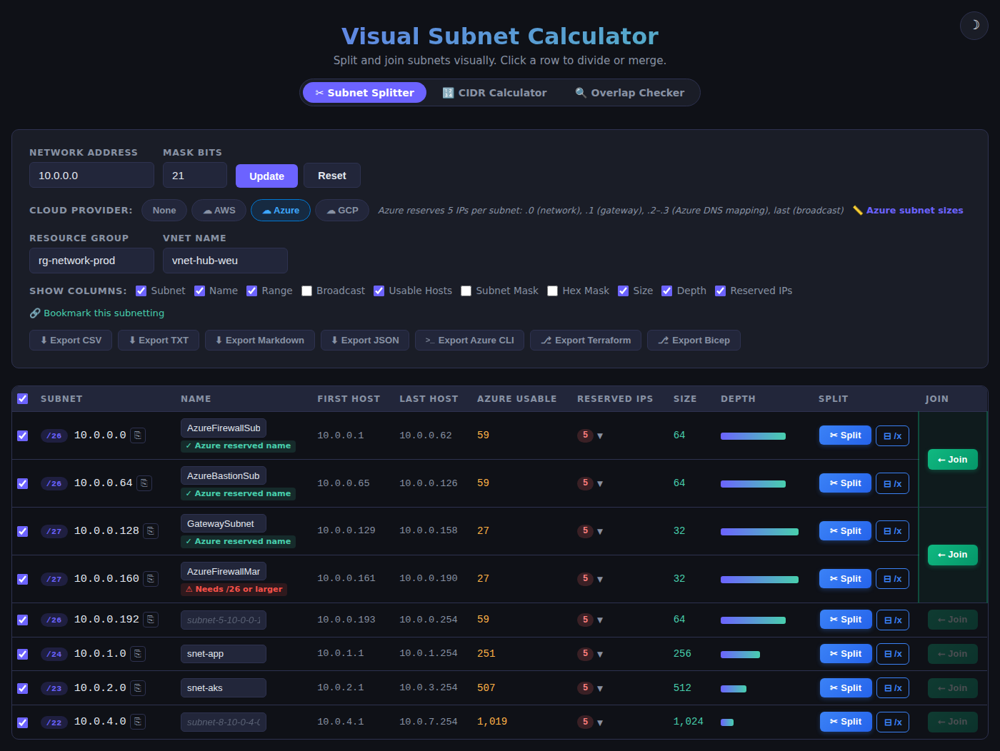

# CIDR Splitter — Visual Subnet Tools for Cloud Admins

Three single-file HTML tools for planning IPv4 networks on AWS, Azure and GCP: split subnets visually, look up a block, and catch overlapping ranges before a peering fails.

## The tools

| Tool | What it does | Try it | Details |
|---|---|---|---|
| **Subnet Splitter** | Split and join a CIDR block visually, see cloud-reserved IPs, export to CSV, JSON, Terraform, Bicep, CloudFormation or CLI scripts | [Open](https://gh.reichert.be/CIDRsplitter/) | [Docs](docs/splitter.md) |
| **CIDR Calculator** | Look up one block: binary breakdown, masks, host range, cloud usable hosts | [Open](https://gh.reichert.be/CIDRsplitter/calculator.html) | [Docs](docs/calculator.md) |
| **Overlap Checker** | Paste many ranges, find overlaps, map free space, get the next free block, flag ranges AWS, Azure and GCP refuse | [Open](https://gh.reichert.be/CIDRsplitter/overlap.html) | [Docs](docs/overlap-checker.md) |

Tabs under each title switch between the tools and carry the current block and cloud provider along.

## Highlights

- **Cloud-aware**: AWS, Azure and GCP reserved IPs, an Azure subnet sizing guide, and per-cloud range checks, each linked to the provider's docs
- **Shareable**: the full state lives in the URL, so a bookmark restores the exact setup
- **No dependencies**: plain HTML, CSS and vanilla JavaScript; works offline
- **Light and dark themes**, defaulting to your OS preference

## Usage

Open `index.html` in any modern browser. There's no build step and no server. Or use the live demo above.

## More

- [Splitter](docs/splitter.md) · [Calculator](docs/calculator.md) · [Overlap Checker](docs/overlap-checker.md)
- [Discoverability and SEO notes](docs/seo.md)
- Inspired by [David Clayworth's Visual Subnet Calculator](https://www.davidc.net/sites/default/subnets/subnets.html) and [cidr.xyz](https://cidr.xyz/)

## License

MIT
