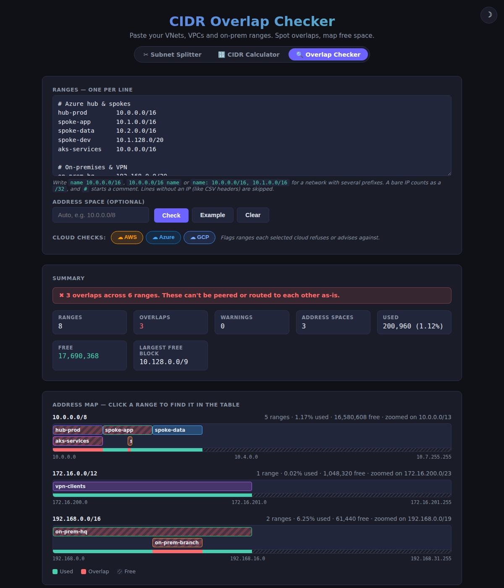

# CIDR Overlap Checker

A third page (`overlap.html`), in the same visual style, for checking **many** ranges against each other: VNets, VPCs, on-premises networks, VPN client pools, Kubernetes service and pod CIDRs. Paste them in and it shows every overlap before a peering or VPN connection fails on it.

[Live demo](https://gh.reichert.be/CIDRsplitter/overlap.html) · [Back to the overview](../README.md)



## Input

One range per line, in any of these forms:

```
hub-prod     10.0.0.0/16
10.1.0.0/16  spoke-app
corp: 10.2.0.0/16, 10.3.0.0/16   # one network, several prefixes
```

- A bare IP counts as a `/32`, and `#` starts a comment.
- Lines without an IP (such as CSV headers) are skipped, so a [Splitter](splitter.md) CSV export can be pasted as is.
- Host bits are normalized: `10.0.0.5/16` becomes `10.0.0.0/16` and is flagged, so a typo can't hide an overlap.
- Results update as you type.

## Overlaps and the address map

- **Overlap detection**: every overlapping pair is listed as *Identical* or *A contains B*, with the number of shared addresses. CIDR blocks can't partly overlap, so those are the only two cases. A verdict banner sums it up.
- **Address map**: one bar per address space, with each range in its own lane, overlaps striped in red and a used/free strip underneath. Large spaces zoom on the occupied part. Click a range to jump to its row.
- **Address space**: leave it on *Auto* for one map per private range in use (`10.0.0.0/8`, `172.16.0.0/12`, `192.168.0.0/16`, `100.64.0.0/10`), or set one explicitly (your `/8` allocation, say) to flag ranges that fall outside it.
- **Range types**: each range is labelled Private (RFC 1918), Shared/CGNAT (RFC 6598), Link-local, Loopback, Multicast, Documentation, Benchmarking, Reserved, Public or Mixed.

## Free space

Two separate views, both below the ranges table:

- **Where does a new block fit?** Enter a prefix length to get the first free, correctly aligned blocks of that size, each with a one-click link to split it in the Splitter.
- **All free space**: everything left unused in each address space, as the fewest CIDR blocks. **Copy Free Blocks** copies the full list, without the tags below.
- **Flagged suggestions**: a free block that a selected cloud refuses or advises against (for example `10.128.0.0/9` with GCP on) stays listed but carries a ⚠ tag naming the cloud. Hover it for the reason.

## Cloud checks

Toggle AWS, Azure and GCP in any combination, for multi-cloud networks. Arriving from the Splitter or Calculator with a provider selected narrows the checks to that provider. Ranges that trip a rule get a badge and count in the **Warnings** total.

| Cloud | Can't use | Advises against | Source |
|---|---|---|---|
| **AWS** (VPC) | `0.0.0.0/8`, `127.0.0.0/8`, `169.254.0.0/16`, `224.0.0.0/4` | `172.17.0.0/16` (AWS Cloud9, SageMaker AI) | [docs](https://docs.aws.amazon.com/vpc/latest/userguide/vpc-cidr-blocks.html) |
| **Azure** (VNet) | `224.0.0.0/4`, `255.255.255.255/32`, `127.0.0.0/8`, `169.254.0.0/16`, `168.63.129.16/32` | | [docs](https://learn.microsoft.com/en-us/azure/virtual-network/virtual-networks-faq) |
| **Azure** (AKS) | `192.0.2.0/24`, `172.30.0.0/16`, `172.31.0.0/16`, plus the link-local range above | | [docs](https://learn.microsoft.com/en-us/azure/aks/concepts-network-cni-overview) |
| **GCP** (subnets) | `0.0.0.0/8`, `127.0.0.0/8`, `169.254.0.0/16`, `224.0.0.0/4`, `255.255.255.255/32`, `199.36.153.4/30`, `199.36.153.8/30` | `10.128.0.0/9` (auto mode subnets), `172.17.0.0/16` (Docker bridge) | [docs](https://docs.cloud.google.com/vpc/docs/subnets) |

Not checked: AWS's `/16`–`/28` VPC size limit and its ban on mixing RFC 1918 ranges in one VPC (the tool doesn't know which lines belong to which VPC), and Google's published public ranges (an external list that changes often). Both are explained in the on-page FAQ.

## Export and sharing

- **CSV** of the ranges and their status.
- **Markdown** report (ranges, overlaps, free space), ready for a wiki or PR.
- **Share Link**: the ranges, address space and settings are encoded in the URL.
- **Row shortcuts**: open any range in the Splitter or the [Calculator](calculator.md), or copy its CIDR.

## FAQ

The on-page FAQ covers how CIDR blocks overlap, peering rules on AWS, Azure and GCP, the ranges each cloud refuses, AKS service CIDR conflicts and the private IPv4 ranges.
